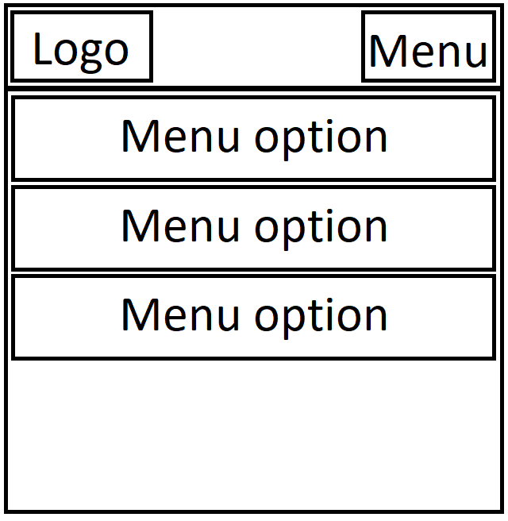

# I. Sports Cars Rental - description

## What the website is about?

The website is about sports car rental. People can find the besc car for their and then rent it.

## Website name

Website name is "Sports Cars Rental".

## Website short description

The Sports Cars Rental is website about renting of sports and luxury cars. It's a website for young people with a lot of money. The main goal of this website is give the ability to rent of cars in easy and fast way. This website contain only one single page and all content is represented by single page application.

# II. Website sections:

## 1. nav - top navigation

### Logo:

Title: SCR 
Subtitle: Sports Cars Rental

### Top navigation

Top navigation options:

- Home,
- About us,
- Our cars,
- Contact

### The concept of mobile nav

:warning: Add the concept of mobile nav !!!

### The concept of tablet nav

:warning: Add the concept of tablet nav !!!

### The concept of desktop nav

:warning: Add the concept of desktop nav !!!

## 2. header - make reservation

### Background video

[https://pixabay.com/pl/videos/seul-ruch-drogowy-samochody-miasto-21118/](https://pixabay.com/pl/videos/seul-ruch-drogowy-samochody-miasto-21118/)

### Form of make reservation

Inputs of form:

- select: select a pickup location
- date: pick-up date
- time: pick-up time
- select: select a drop-off location
- date: drop-off date
- time: drop-off time
- button: Search

### Motto of header

Motto title: Make your dreams come true! 
Motto text: Find the best car for you in a few moments.

### The concept of mobile header

:warning: Add the concept of mobile header !!!

### The concept of tablet header

:warning: Add the concept of tablet header !!!

### The concept of desktop header

:warning: Add the concept of desktop header !!!

## 3. section - about us

Title: About us

Text: Welcome! We are Sports Cars Rental from Poland and this is our company! We specialize in delivering sports and luxury cars to our clients. In our assortment we have a lot of kinds expensive cars like: Lamborghini, Ferrari, Ford Mustang, Chevrolet Corvette, Bugatti Chiron, Bentley etc. We also have more classic cars for enthusiasts of classic motoring like: Ferrari Testarossa, Chevrolet Corvette C3, Ford Mustang. All the cars are in great condition!

Text: We have been operating since 1999 with a very long tradition. We started as a small company with a few sports cars, and now we serve clients and companies from all over Poland! Our cars also occurs in the many car events. We have got a lot of awards and distinctions!

Text: Familiarize yourself with our offers, choose the best car for you and make your dream come true!

Button: Choose your car

### The concept of mobile section - about us

:warning: Add the concept of mobile section - about us !!!

### The concept of tablet section - about us

:warning: Add the concept of tablet section - about us !!!

### The concept of desktop section - about us

:warning: Add the concept of desktop section - about us !!!

## 4. section - our cars 👍

### 1. Lamborghini Huracan

#### Image link:

[https://pixabay.com/pl/photos/lamborghini-huracan-4815249/](https://pixabay.com/pl/photos/lamborghini-huracan-4815249/)

#### Title: Lamborghini Huracan

#### Main price: 50.000 zł

#### Specyfication:

- power = 610 KM / 560 Nm
- 0-100 = 3.2 s
- gearbox = Automatic
- number of seats = 2
- max speed = 325 km/h

#### Price list:

- 2-3 days = 4500 zł / za dobę,
- 4-6 days = 3500 zł / za dobę
- 7-13 days = 2750 zł / za dobę
- 14-29 days = 2500 zł / za dobę
- month = 50.000 zł

#### Footer:

button: Rent this car

p: This car is available at the moment!

### 2. Ferrari F430

#### Image link:

[https://pixabay.com/pl/photos/ferrari-f430-ferrari-supersamoch%c3%b3d-2930661/](https://pixabay.com/pl/photos/ferrari-f430-ferrari-supersamoch%c3%b3d-2930661/)

#### Title: Ferrari F430

#### Main price: 45.000 zł

#### Specyfication:

- power = 610 KM / 560 Nm
- 0-100 = 3.2 s
- gearbox = Automatic
- number of seats = 2
- max speed = 325 km/h

#### Price list:

- 2-3 days = 4000 zł / za dobę
- 4-6 days = 3400 zł / za dobę
- 7-13 days = 2500 zł / za dobę
- 14-29 days = 2200 zł / za dobę
- month = 45.000 zł

#### Footer:

button: Rent this car

p: This car is available at the moment!

### 3. Ford Mustang GT500

#### Image link:

[https://pixabay.com/pl/photos/samoch%c3%b3d-pojazd-mustang-3344988/](https://pixabay.com/pl/photos/samoch%c3%b3d-pojazd-mustang-3344988/)

#### Title: Ford Mustang GT500

#### Main price: 40.000 zł

#### Specyfication:

- power = 610 KM / 560 Nm
- 0-100 = 3.2 s
- gearbox = Automatic
- number of seats = 2
- max speed = 325 km/h

#### Price list:

- 2-3 days = 3500 zł / za dobę
- 4-6 days = 3000 zł / za dobę
- 7-13 days = 2500 zł / za dobę
- 14-29 days = 2000 zł / za dobę
- month = 40.000 zł

#### Footer:

button: Rent this car

p: This car is not available at the moment!

### 4. Chevrolet corvette

#### Image link:

[https://pixabay.com/pl/photos/corvette-stingray-samoch%c3%b3d-6483116/](https://pixabay.com/pl/photos/corvette-stingray-samoch%c3%b3d-6483116/)

#### Title: Chevrolet corvette

#### Main price: 30.000 zł

#### Specyfication:

- power = 610 KM / 560 Nm
- 0-100 = 3.2 s
- gearbox = Automatic
- number of seats = 2
- max speed = 325 km/h

#### Price list:

- 2-3 days = 2000 zł / za dobę
- 4-6 days = 1700 zł / za dobę
- 7-13 days = 1500 zł / za dobę
- 14-29 days = 1200 zł / za dobę
- month = 30.000 zł

#### Footer:

button: Rent this car

p: This car is available at the moment!

### 5. Bugatti Chiron

#### Image link:

[https://pixabay.com/pl/photos/samoch%c3%b3d-poka%c5%bc-samoch%c3%b3d-automatyczny-5774774/](https://pixabay.com/pl/photos/samoch%c3%b3d-poka%c5%bc-samoch%c3%b3d-automatyczny-5774774/)

#### Title: Bugatti Chiron

#### Main price: 120.000 zł

#### Specyfication:

- power = 610 KM / 560 Nm
- 0-100 = 3.2 s
- gearbox = Automatic
- number of seats = 2
- max speed = 325 km/h

#### Price list:

- 2-3 days = 8000 zł / za dobę
- 4-6 days = 7500 zł / za dobę
- 7-13 days = 7200 zł / za dobę
- 14-29 days = 6700 zł / za dobę
- month = 120.000 zł

#### Footer:

button: Rent this car

p: This car is available at the moment!

### 6. Bentley

#### Image link:

[https://pixabay.com/pl/photos/bentley-samoch%c3%b3d-pojazd-5588541/](https://pixabay.com/pl/photos/bentley-samoch%c3%b3d-pojazd-5588541/)

#### Title: Bentley

#### Main price: 220.000 zł

#### Specyfication:

- power = 610 KM / 560 Nm
- 0-100 = 3.2 s
- gearbox = Automatic
- number of seats = 2
- max speed = 325 km/h

#### Price list:

- 2-3 days = 10000 zł / za dobę
- 4-6 days = 9500 zł / za dobę
- 7-13 days = 9000 zł / za dobę
- 14-29 days = 8500 zł / za dobę
- month = 220.000 zł

#### Footer:

button: Rent this car

p: This car is available at the moment!

### 7. BMW M4

#### Image link:

[https://pixabay.com/pl/photos/bmw-m4-zamienny-bmw-m4-3169357/](https://pixabay.com/pl/photos/bmw-m4-zamienny-bmw-m4-3169357/)

#### Title: BMW M4

#### Main price: 15.000 zł

#### Specyfication:

- power = 610 KM / 560 Nm
- 0-100 = 3.2 s
- gearbox = Automatic
- number of seats = 2
- max speed = 325 km/h

#### Price list:

- 2-3 days = 2000 zł / za dobę
- 4-6 days = 1500 zł / za dobę
- 7-13 days = 1200 zł / za dobę
- 14-29 days = 700 zł / za dobę
- month = 15.000 zł

#### Footer:

button: Rent this car

p: This car is not available at the moment!

### 8. Mercedes-Benz G-Class

#### Image link:

[https://pixabay.com/pl/photos/mercedes-benz-luksusowy-samoch%c3%b3d-5263081/](https://pixabay.com/pl/photos/mercedes-benz-luksusowy-samoch%c3%b3d-5263081/)

#### Title: Mercedes-Benz G-Class

#### Main price: 18.000 zł

#### Specyfication:

- power = 610 KM / 560 Nm
- 0-100 = 3.2 s
- gearbox = Automatic
- number of seats = 2
- max speed = 325 km/h

#### Price list:

- 2-3 days = 2200 zł / za dobę
- 4-6 days = 1600 zł / za dobę
- 7-13 days = 1400 zł / za dobę
- 14-29 days = 900 zł / za dobę
- month = 18.000 zł

#### Footer:

button: Rent this car

p: This car is available at the moment!

### 9. Ferrari Testarossa

#### Image link:

[https://pixabay.com/pl/photos/obw%c3%b3d-%c5%9bledzi%c4%87-pr%c4%99dko%c5%9b%c4%87-szybki-5183476/](https://pixabay.com/pl/photos/obw%c3%b3d-%c5%9bledzi%c4%87-pr%c4%99dko%c5%9b%c4%87-szybki-5183476/)

#### Title: Ferrari Testarossa

#### Main price: 65.000 zł

#### Specyfication:

- power = 610 KM / 560 Nm
- 0-100 = 3.2 s
- gearbox = Automatic
- number of seats = 2
- max speed = 325 km/h

#### Price list:

- 2-3 days = 6000 zł / za dobę
- 4-6 days = 5500 zł / za dobę
- 7-13 days = 5000 zł / za dobę
- 14-29 days = 4500 zł / za dobę
- month = 65.000 zł

#### Footer:

button: Rent this car

p: This car is available at the moment!

### 10. Chevrolet Corvette C3

#### Image link:

[https://pixabay.com/pl/photos/samoch%c3%b3d-chevrolet-5573484/](https://pixabay.com/pl/photos/samoch%c3%b3d-chevrolet-5573484/)

#### Title: Chevrolet Corvette C3

#### Main price: 40.000 zł

#### Specyfication:

- power = 610 KM / 560 Nm
- 0-100 = 3.2 s
- gearbox = Automatic
- number of seats = 2
- max speed = 325 km/h

#### Price list:

- 2-3 days = 4000 zł / za dobę
- 4-6 days = 3500 zł / za dobę
- 7-13 days = 2000 zł / za dobę
- 14-29 days = 1500 zł / za dobę
- month = 40.000 zł

#### Footer:

button: Rent this car

p: This car is available at the moment!

### 11. Ford Mustang

#### Image link:

[https://pixabay.com/pl/photos/samoch%c3%b3d-zabytkowy-samoch%c3%b3d-2386917/](https://pixabay.com/pl/photos/samoch%c3%b3d-zabytkowy-samoch%c3%b3d-2386917/)

#### Title: Ford Mustang

#### Main price: 18.000 zł

#### Specyfication:

- power = 610 KM / 560 Nm
- 0-100 = 3.2 s
- gearbox = Automatic
- number of seats = 2
- max speed = 325 km/h

#### Price list:

- 2-3 days = 3000 zł / za dobę
- 4-6 days = 2500 zł / za dobę
- 7-13 days = 1000 zł / za dobę
- 14-29 days = 800 zł / za dobę
- month = 18.000 zł

#### Footer:

button: Rent this car

p: This car is not available at the moment!

### 12. Dodge Challenger

#### Image link:

[https://pixabay.com/pl/photos/dodge-challenger-srt8-b%c4%99dzie-4418202/](https://pixabay.com/pl/photos/dodge-challenger-srt8-b%c4%99dzie-4418202/)

#### Title: Dodge Challenger

#### Main price: 45.000 zł

#### Specyfication:

- power = 610 KM / 560 Nm
- 0-100 = 3.2 s
- gearbox = Automatic
- number of seats = 2
- max speed = 325 km/h

#### Price list:

- 2-3 days = 4000 zł / za dobę
- 4-6 days = 3500 zł / za dobę
- 7-13 days = 2500 zł / za dobę
- 14-29 days = 2000 zł / za dobę
- month = 45.000 zł

#### Footer:

button: Rent this car

p: This car is available at the moment!

## 5. section - opinions

### Opinion 1

Jan Kowalski

Description

### Opinion 2

Jan Kowalski

Description

### Opinion 3

Jan Kowalski

Description

## 6. section - statistics 👍

- cars on offer: 12
- assistance: 24h / 7
- experience: 23 years
- locations: 5

## 7. footer

### 1. section - localization on the map

### 2. section - contact form

### 3. section - footer navigation

### 4. section - copyright 👍

Copyright &copy; | Sports Cars Rental by Jakub Olejarczyk

# III. Website concepts:

## 1. nav - navigation

### Nav Mobile 👍

### Tablet Mobile 😒

### Pc Mobile 😒

### 4k Mobile 😒
